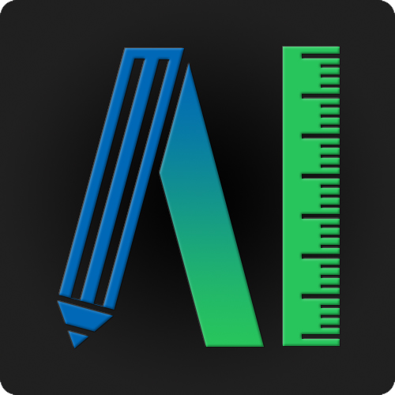

# easy ai
easy ai

[代码规范](http://www.imooc.com/article/19184?block_id=tuijian_wz#child_5_1)

# Annotations
  * [annotations](https://github.com/MiniBullLab/easy_sample_mark)
  
# ARM
 * [ARM](https://github.com/MiniBullLab/easy_arm)

# Project
* [Project](https://github.com/MiniBullLab/easy_project)

# Docker
* [easy_docker](https://github.com/MiniBullLab/easy_docker)
